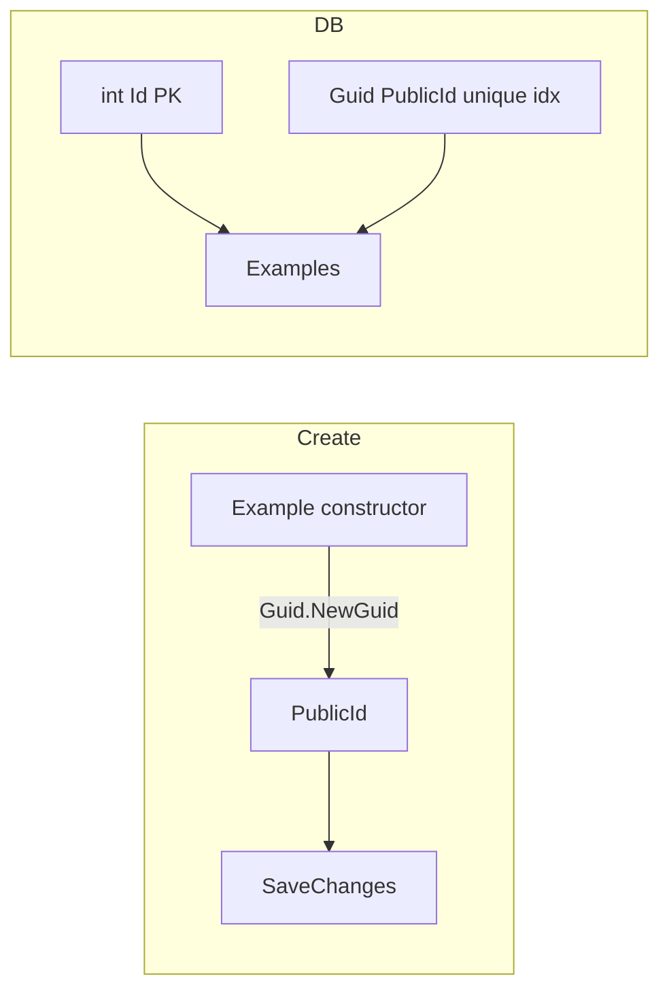

# Plan: Añadir PublicId (Guid) con índice

## Objetivo

Añadir `Guid PublicId` como identificador público, manteniendo `int Id` como clave primaria. Índice único sobre `PublicId` para búsquedas eficientes.

## Cambios

### 1. Dominio

**[BaseDomainModel.cs](c:\Users\arces\source\repos\Template\Microservice\Microservice.Domain\ValueObjects\BaseDomainModel.cs)**

- Añadir `public Guid PublicId { get; set; }`

**[Example.cs](c:\Users\arces\source\repos\Template\Microservice\Microservice.Domain\Entities\Example.cs)**

- En el constructor público: asignar `PublicId = Guid.NewGuid()`

### 2. Infraestructura

**[ExampleDbContext.cs](c:\Users\arces\source\repos\Template\Microservice\Microservice.Infrastructure\Persistence\ExampleDbContext.cs)**

- En `OnModelCreating`: añadir índice único sobre `PublicId`:

```csharp
entity.HasIndex(e => e.PublicId).IsUnique();
```

**Migración:** ejecutar `dotnet ef migrations add AddPublicIdToExample`

- Añadir columna `PublicId` (uuid, not null, unique)
- Para filas existentes: generar Guid por fila (p. ej. `UPDATE Examples SET "PublicId" = gen_random_uuid() WHERE "PublicId" IS NULL` si se permite nullable temporalmente; o migración en dos pasos)

### 3. DTOs

Añadir `public Guid PublicId { get; set; }` en:

- `GetAllExamplesDto`, `GetExampleByIdDto`, `GetExampleByPredicateDto`
- `GetExamplesPaginatedDto`, `GetExamplesWithProjectionDto`, `GetExampleWithProjectionDto`
- `GetExamplesFromSqlDto`, `ExecuteSqlWithResultDto`

### 4. Proyecciones

En `GetExamplesWithProjectionQueryHandler` y `GetExampleWithProjectionQueryHandler`: incluir `PublicId` en la proyección.

### 5. Controller: búsqueda por PublicId

Reemplazar parámetro `id` por `publicId` (Guid) en rutas que buscan por identificador:


| Endpoint                          | Antes       | Después                             |
| --------------------------------- | ----------- | ----------------------------------- |
| GET /api/examples/{id}            | `int id`    | `Guid publicId` → `{publicId:guid}` |
| GET /api/examples/{id}/exists     | `int id`    | `Guid publicId` → `{publicId:guid}` |
| GET /api/examples/{id}/projection | `int id`    | `Guid publicId` → `{publicId:guid}` |
| PUT /api/examples/{id}            | `int id`    | `Guid publicId` → `{publicId:guid}` |
| PUT /api/examples/{id}/fields     | `int id`    | `Guid publicId` → `{publicId:guid}` |
| DELETE /api/examples/{id}         | `int id`    | `Guid publicId` → `{publicId:guid}` |
| PUT /api/examples/batch           | `int[] ids` | `Guid[] publicIds`                  |
| DELETE /api/examples/batch        | `int[] ids` | `Guid[] publicIds`                  |
| POST Create response              | `int` (Id)  | `Guid` (PublicId)                   |


### 6. Commands y Queries (cambiar Id → PublicId)

- `CreateExampleCommand` → retornar `Result<Guid>` (PublicId del recurso creado)
- `GetExampleByPredicateQuery`, `ExistsExampleQuery`, `GetExampleWithProjectionQuery` → parámetro `Guid publicId`
- `UpdateExampleCommand`, `UpdateExampleFieldsCommand`, `DeleteExampleCommand` → parámetro `Guid publicId`
- `UpdateManyExamplesCommand`, `DeleteManyExamplesCommand` → parámetro `Guid[] publicIds`
- Los handlers usan `GetEntityAsync(x => x.PublicId == request.PublicId)` en lugar de `FindAsync(request.Id)`

### 7. Tests

- Actualizar tests que crean `Example` para asignar `PublicId` en mocks
- Actualizar DTOTests si se añaden assertions sobre `PublicId`

## Flujo de datos




## Nota sobre FindAsync

`IReadRepository.FindAsync(int id)` busca por PK. Al usar PublicId en la API, los handlers usarán `GetEntityAsync(x => x.PublicId == publicId)` para buscar por PublicId (aprovechando el índice único). No es necesario modificar la interfaz del repositorio.